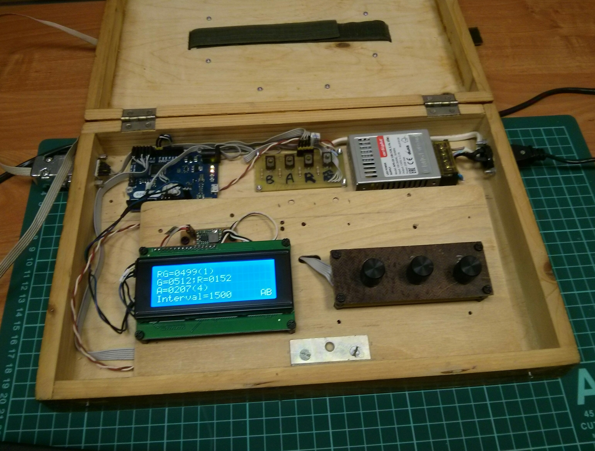
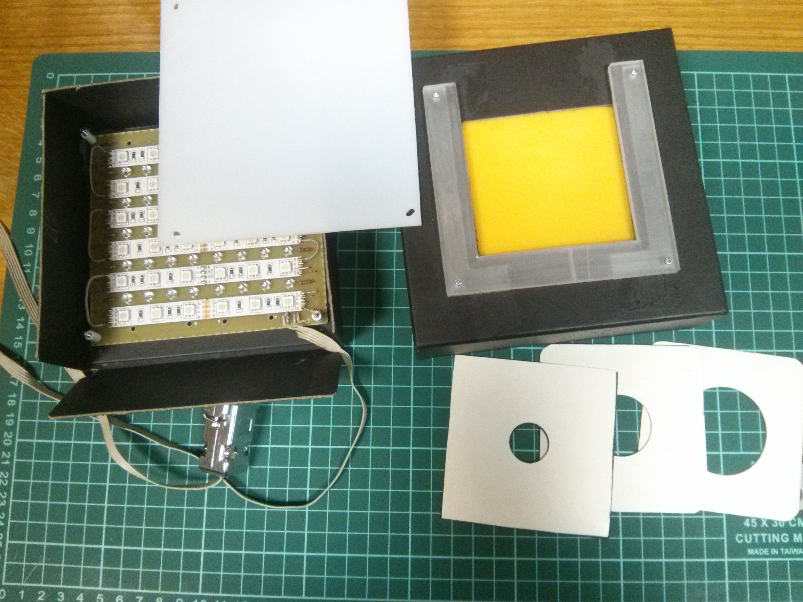

# as
Construction of prototype free-view extra cheap anomaloscope with alternating fields.

The device consists of control box and stimulus box.

Control box is arduino based.

Arduino Leonardo was used to provide at least 3 PWM channels with 10-bit resolution.

Power supply is DC 12V 2A.

Three encoders were connected to arduino with common bus method (https://github.com/j-bellavance/CommonBusEncoders).

LCD display is 2004 with I2C interface.

DC-DC convertor from 12V to 5V was ised for display backlight.

Software for control box is in /src folder.

 scetch provides alternation of RG mixture field and A (Amber == Yellow) field with interval of 1.5 sec.

 scetch provides static fields presentation for spectral measurements.

PCBs were developed with [Fritzing](https://fritzing.org). Fritzing files and PCB images are in /pcb folder.

One-sided PCBs were made with LUT technology (laser printer + iron).

Stimulus box is black cartoon box of 14X14X5 cm.

For RG field 12V RGB led strip was used with 5050 smd leds, 60 per meter, 14W/m power ([Arlight](https://arlight.ru)),
but one can use analogoues strips.

Spectral measurements were done with X-Rite Eye One spectrophotometer in hi-res mode.

Peak inensities of leds are: R - 620 nm, G - 520 nm, A - 590 nm.

To eliminate blue cone excitation it is nessesary to use green light > 540 nm.
As there are no commercially available green leds with peak lambda of 550 nm, we
filter out radiation less than 540 nm with yellow plastic plate.
We succeeded to select suitable opale acrylic yellow plate among many samples.

Alternatively one can use 5 layers of cellophane paper ([Sadipal](https://sadipal.com) Ref. 06162 Amarillo).
The plate was mounted on the back side of stimulus box cover.

Another plate, white opale plastic plate was mounted on PCB above leds.

Such construction provides good uniformity of field lights.

Stimulus box was equipped with exchangeable white diaphragms with 2, 3 or 4 cm circular windows.

